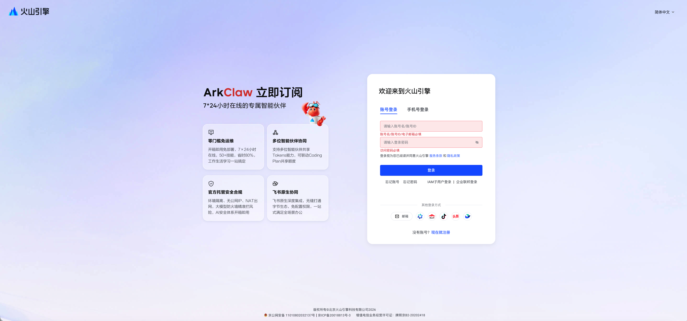
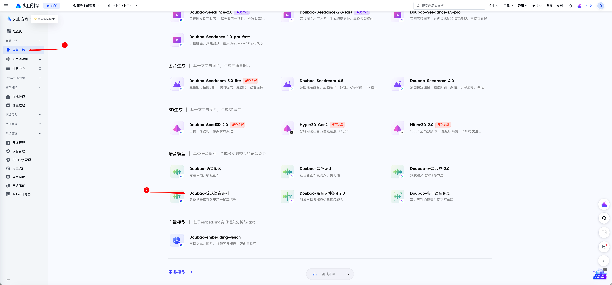
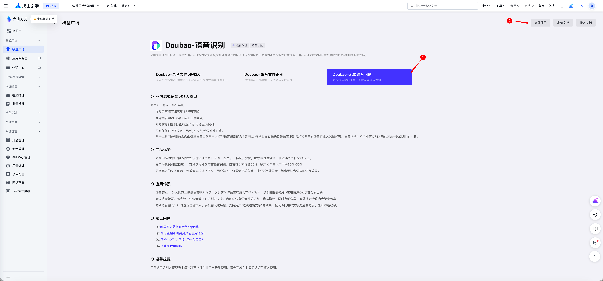
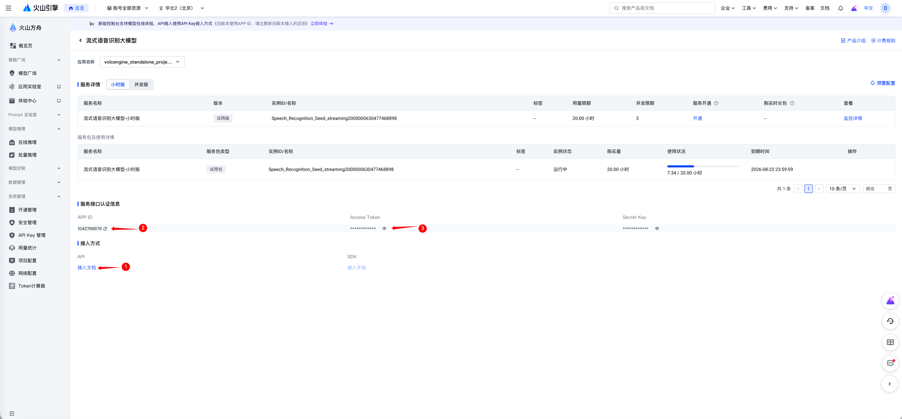
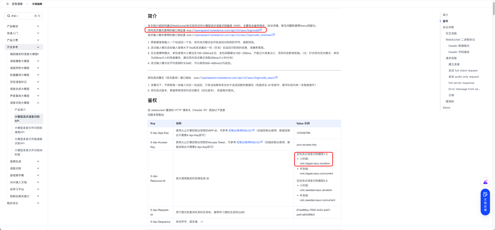
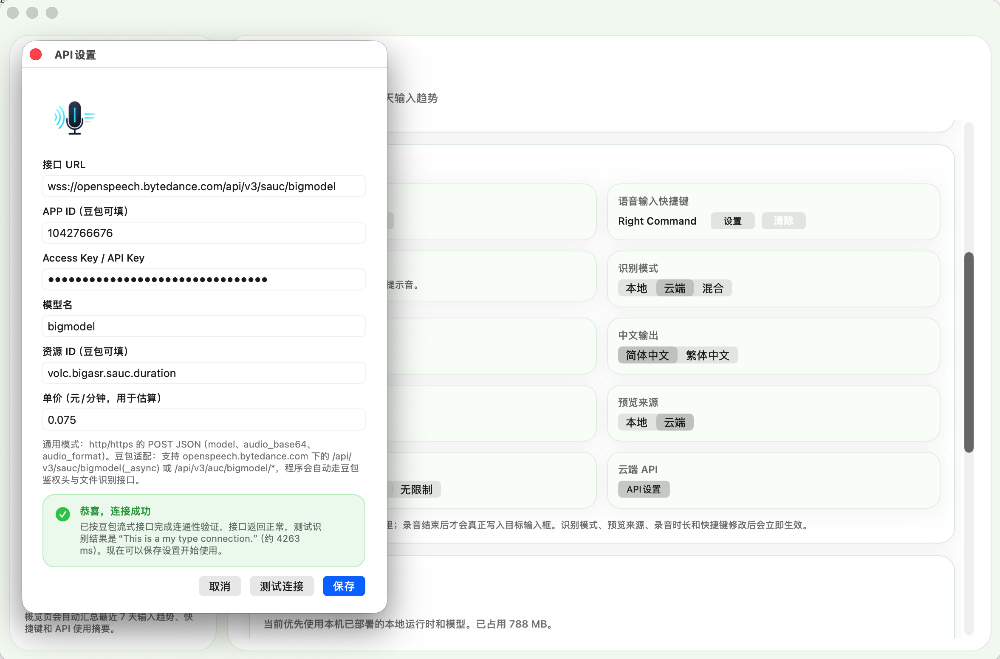

**说明：**
作者仅使用了豆包流式语音模型并打通测试，推荐优先选择使用。其他模型如果遇到连接问题，欢迎反馈。反馈方式：小红书账号 大牙大，私信或者加入群聊。

**以下内容以字节火山引擎注册及API设置举例：**

**第一步**
进入字节的火山引擎官网，登录或注册账号。注册火山引擎领取豆包免费20小时语音模型

**第二步**
登录之后，在左侧点击【模型广场】，右侧模型列表中找到【DouBao-流式语音识别】。

**第三步**
确认选择【流式语音识别】，点击右上角【立即使用】

**第四步**
领取注册赠送的20小时体验权限后，可以先点开【使用文档】，然后【①②】2个信息需要在MyType的API设置中填入的核心信息。

**第五步**
如果是使用豆包赠送的20小时权限的朋友，复制图片中框选出来的信息。如果是自己付费的朋友使用【双向流式模式（优化版本）和豆包流式语音识别模型2.0】

**第六步**
打开MyType设置页面，找到【API】设置

依次填写信息后，点击【测试连接】，反馈【恭喜，连接成功】，即可开始使用。

**大家也可以直接复制下方信息：**

接口URL：wss://openspeech.bytedance.com/api/v3/sauc/bigmodel
自行复制填入你的 APP ID
自行复制填入你的 Access Key
模型名：bigmodel
资源ID：volc.bigasr.sauc.duration
【豆包流式语音模型，后付费规则，官方价格是4.5元/小时】